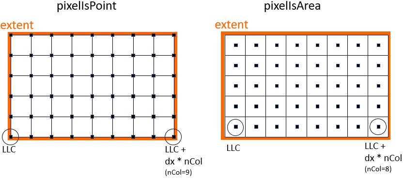

**Oorspronkelijke voorstel DD-GRID-API**
========================================

**Inleiding**
-------------

Dit document bevat de beschrijving van een eerste, niet meer actuele, conceptversie van de DD-GRID-API, de Digitale Delta API voor roosterdata (oftewel grid data).

Deze conceptversie was het resultaat van:

- een achttal vergaderingen in 2018 met de roosterdata-groep, een subgroep van de DD-werkgroep. Het eerste deel van de sessies richtte zich op het in kaart brengen van de gewenste functionaliteit, het tweede deel op het uitwerken van het DD-GRID-voorstel.
- Een vervolgsessie in 2020 (27 mei)

Vervolgens werd geconcludeerd dat erg veel gelijkenis was met de ontwikkeling van de [OGC API Coverages](https://github.com/opengeospatial/ogc_api_coverages) (zelfde structuur, afwijkende terminologie). Daarom is besloten bij de verdere uitwerking uit te gaan van de OGC API Coverages. Zie de daaruit voortgekomen [DD-GRID-API](../dd-grid-api-documenation-nl.md) voor het resultaat.

**Leeswijzer**
-------------

De opbouw van dit document is als volgt:

- Het eerste hoofdstuk beschrijft de tijdens het uitwerken gemaakte afspraken;
- Het tweede hoofdstuk geeft enkele onderwerpen aan waarover nog een keuze over gemaakt moet worden;
In dat hoofdstuk staan de opmerkingen die zijn voortgekomen uit de sessie van 27 mei.
- Het derde hoofdstuk bevat de conceptversie van de end points van de DD-GRID-API.
- Het vierde hoofdstuk bevat en nog enigszins summiere conceptversie van de response van de end points van de DD-GRID-API.
 De inhoud van de resource objects in de response is afgeleid uit:
  - Vergelijkbare resource objects in de DD-API
  - De overzichtstabel met functionele eisen
 (FunctioneleEisenRoosterdataDdAPI-v0.95.xlsx)

Zodra deze conceptversies redelijk definitief zijn zal e.e.a. worden omgezet in een OAS3-specificatie, die we op github gaan zetten.

**Gemaakte afspraken**
----------------------

Tijdens de bespreking van de diverse conceptversies zijn de volgende algemene afspraken gemaakt:

- Bij de DD-API gebruiken we paging. Bij de DD-GRID api stellen we dat niet verplicht.
 Het mag echter wel worden ge&#239;mplementeerd.
- I.v.m. de consistentie voegen we, net als bij de DD-API, aan de metadata response de 'node' informatie toe (en we voegen nodeId toe als query parameter)
- De boundingBox query parameter kan bij vrijwel alle end points worden meegeven, t.b.v. ruimtelijke selectie
 In de response zitten de grids die geheel _of gedeeltelijk_ binnen de boundingBox vallen.

- M.b.t. de naming convention van de endpoints en de query-parameters baseren we ons op de voorbeelden van [API strategie voor de Nederlandse overheid](https://docs.geostandaarden.nl/api/API-Strategie/): parameters camelCase, en end points zonder hoofdletters. Bij complexe end point namen (maar die hebben we momenteel nog niet) scheiden we de delen d.m.v. een '-', zulks conform de naming conventions van [https://restfulapi.net/](https://restfulapi.net/).
- Overwogen is om /griddatasets te mengen met de /timeseries van de DD-API. Besloten is echter om de roosterdata er helemaal naast te zetten, want:
  - Voor een gebruiker gaat het om andere functionaliteit dan tijdseries
  - Niet alle systemen leveren de mix van zowel tijdseries als roosterdata.

Wel is er overlap met de DD-API:

  - Provider info en error handling wordt conform de DD-API gedaan
  - Als een databron paging implementeert wordt dat gedaan conform de DD-API
  - Als van uit grid-data een tijdserie op &#233;&#233;n roosterpunt wordt opgevraagd is de respons gelijk aan die van het DD-API _/timeseries_ end point.
- Tijdens het opstellen van de conceptversie van de end points rees de vraag of we aparte _/sources_ en _/grids_ end points nodig hebben, of dat combineren handiger is, omdat het grotendeels overlap (en bij b.v. Matroos het effectief hetzelfde is).
 Na enig nadenken is besloten om (in elk geval voorlopig) alleen _/grids_ te kennen.
 Onderdeel van de respons is dan de source.
 Meerdere grids voor een zelfde model kan dan betekenen:
  - dat er een grof en een fijn rooster is
  - dat het totale grid is opgedeeld in subdomeinen.

We bekijken in de loop van de tijd want nodig is, mede aan de hand van de info in de _/grid_-response en de vraag waar je op wilt kunnen filteren.

- Er is overwogen om, naast het kunnen specificeren van de gewenste projectie bij het opvragen van data, ook te kunnen specificeren in welk crs de bounding-box bij de query is opgegeven. Dit leidde voor een eerste versie tot teveel complexiteit. Besloten is dus om dat te laten vallen en het volgende af te spreken:
  - Bij discovery functies wordt de bounding box altijd in wgs84 uitgedrukt
  - Bij het opvragen van data wordt aangegeven in welke projectie de data moet worden geleverd, en wordt de bounding box waarbinnen data geleverd moet worden uitgedrukt in diezelfde projectie.

**Openstaande punten**
----------------------

Ongetwijfeld komen er bij het in detail in OAS3 uitwerken van de specificaties, en bij het daadwerkelijk implementeren nog diverse punten naar voren. Bij dit tweede concept echters staan de volgende punten open (in rood de punten uit de sessie van 27 mei):

- Is de naamgeving van de end points inhoudelijk goed? (griddatasets, griddata, etc.?)
Nee:
  - We verwijderen het prefix _grid._
  - We denken nog eens goed na over de namen, vooral over /datasets en /data, aangezien die namen tot verwarring kunnen leiden.
 (Zie notulen 11205913-DSC-15-BV-DD-Roosterdata-20200527).
- Hoe noemen we de API? (Hangt waarschijnlijk samen met voorgaande vraag.)
 Voorlopig noemen we hem DD-GRID-API.
- Welke parameters, en onder welke naam, kennen we bij de end points?
 Item is in rood bij de end point beschrijvingen aangegeven.
- Betere namen voor de afmetingen van een curvilinear grid.
 Zie bij 'CurvilinearGrid' in het response-hoofdstuk.
- Extent en 'geo\_transform' zitten nu dubbel in de respons.
 Complicerend daarbij is 'pixel-is-area' vs 'pixel-is-point'.
 Item is aan het eind van het vierde hoofdstuk, de beschrijving van de respons, beschreven.

**Conceptversie DD-GRID-API end points**
----------------------------------------

| **End point** | **parameters** | **omschrijving** |
| --- | --- | --- |
| **/projections** | | Welke projecties ondersteunt het systeem? Response: lijst van projecties waar bij het opvragen van data naar toe kan worden getransformeerd |
| **/grids** | | Welke grids kent de provider? Response: lijst met metadata-objecten van grids (kan mengeling van rasters en curvilineair zijn) |
| | _boundingBox_ | Gebied van interesse |
| | _observationTypeId_ | observationType identifier |
| | _quantity_ | quantity (attribuut van observation type) |
| | _parameterCode_ | parameter (attribuut van observation type) |
| | _/grids/{gridId}_ | metadata van een grid |
| |  _(opm.: param. combinatie kan niet-bestaand zijn)_ | |
| **/observationtypes** | | Welke observation types kent de provider?Response: lijst met metadata-objecten van observationTypes |
| | _boundingBox_ | Gebied van interesse |
| | _gridId_ | gridId |
| |  _(opm.: param. combinatie kan niet-bestaand zijn)_ | |
| **/observationtypes/{observationtypeId}** | | metadata van een observationType |
| **/datasets** | | Welke datasets kent de provider? Response: lijst met daadwerkelijk beschikbare data (telkens een combinatie grid en observationType, of grid en quantity) |
|  | _gridId_ | gridId |
| | _observationTypeId_ | observationTypeId |
| | _quantity_ | quantity (attribuut van observation type) |
| | _parameterCode_ | parameter (attribuut van observation type) |
| | _startTime_ | 'data vanaf (inclusief)' |
| | _endTime_ | 'data tot en met' |
| | _analysisTime_ | Productietijd van de data set |
| |  _(opm.: param. combinatie kan niet-bestaand zijn)_ | |
| **/datasets/{dataSetId}** | | metadata van een dataset (grid en observationType) |
| **/dataformats** | | Ondersteunde data formats. Minimaal "netcdf-cf" |
| **/data** | | Opvragen van data van een of meer datasetsLeiden tot &#233;&#233;n of meer variabelen in de netcdf-cf file |
| | _dataSetId[]_ |  |
| | _gridId_ _observationTypeId[]_ | |
| | _gridId_ _quantity[]_ | |
| | _gridId_ _parameterCode[]_ |  opm.: _dataSetId(s)_ &#243;f _gridId+observationTypeId(s)_ &#243;f _gridId+quantitie(s)_ &#243;f _gridId+parameterCode(s)_ |
| | _startTime_ | Data vanaf (inclusief) |
| | _endTime_ | Data tot en met |
| | _analysisTime_ | Productietijd van de data set |
| | _realization_ | Realization index |
| | _point[]_ | X,Y-punt(en) Response is dan een json file met een lijst van tijdseries conform de response van de DD-API. (De lijst is 1 lang als er om 1 grootheid op 1 punt is gevraagd.) |
| |
| | _projection_ | Gewenste projectie. (Tevens projectie van de areaOfInterest.) |
| |
| | _areaOfInterest_ | WKT-string die de gewenste uitsnede beschrijft |

Opm.:  
'[]' Is het voorstel voor de syntax bij een 'array. Variabelen scheiden door ';'.  
B.v.: _/griddata?dataSetId=dscm\_waterlevel;dscm\_bedlevel&amp;startTime=..._  
(Dit is inhoudelijk overigens hetzelfde als:  
_/griddata?gridId=dscm&amp;dataSetId=waterlevel;bedlevel&amp;startTime=..._)

We hebben besloten om **/data** het enige end point te laten zijn voor het opvragen van data, zowel voor &#233;&#233;n variable als voor meerdere. E&#233;n of meer is gedekt door het optioneel toevoegen van _'...;nog-iets...'_.

We moeten ons afvragen of we de vrijheid die in bovenstaand voorstel wordt geboden om de dataset te specificeren datawerkelijk willen. Misschien is dataSetId(s) voldoende?

**Conceptversie DD-GRID response**
----------------------------------

Response van _/projections_
---------------------------

string[] array		(lijst met EPSG projectie codes - of moet dit uitgebreider?)

Response van _/grids_
---------------------

| Grid[] array |                   |               |                                                    |
|--------------|-------------------|---------------|----------------------------------------------------|
|              | Grid:             |               |                                                    |
|              |                   | id:           | string                                             |
|              |                   | type:         | enum: raster/curvilinear/unstructured              |
|              |                   | extent:       | Extent                                             |
|              |                   | source:       | Source                                             |
|              |                   | raster:       | RasterGrid                                         |
|              |                   | curvilinear:  | CurvilinearGrid                                    |
|              |                   | unstructured: | UnstructuredGrid                                   |
|              |                   |               |                                                    |
|              | Extent:           | […,…,…,…]     | (lowerLeftX, lowerLeftY,  upperRightX, upperRightY) |
|              |                   |               |                                                    |
|              | RasterGrid:       |               |                                                    |
|              |                   | xLLCorner     |                                                    |
|              |                   | yLLCorner     |                                                    |
|              |                   | nCols         |                                                    |
|              |                   | nRows         |                                                    |
|              |                   | colSize       |                                                    |
|              |                   | rowsize       |                                                    |
|              |                   | rotation      |                                                    |
|              |                   | pointType     | pixelIsPoint of pixelIsArea zie 'Opmerkingen'      |
|              |                   |               |                                                    |
|              | CurvilinearGrid:  |               |                                                    |
|              |                   | axis1Size     | (aantal roostercellen 1e richting)                 |
|              |                   | axis2Size     | (aantal roostercellen 2e richting)                 |
|              |                   | vertSize      | (aantal lagen)                                     |
|              |                   |               |                                                    |
|              | UnstructuredGrid: |               |                                                    |
|              |                   | numNodes      | (aantal roosterpunten)                             |
|              |                   | numEdges      | (aantal links tussen roosterpunten)                |
|              |                   | numFaces      | (aantal roostercellen)                             |

Response van _/observationtypes_
-----------------------------
			
ObservationType[] array (conform DD-API).
			
Response van _/griddatasets_
---------------------

| GridDataSet[] array |              |                   |                 |
|---------------------|--------------|-------------------|-----------------|
|                     | GridDataSet: |                   |                 |
|                     |              | id:               | string          |
|                     |              | observationType:  | ObservationType (conform DD-API)|
|                     |              | startTime:        | DateTime        |
|                     |              | endTime:          | DateTime        |
|                     |              | analysisTime:     | DateTime        |
|                     |              | realizationCount: |                 |

Response van _/dataformats_
---------------------------

string[] array		(lijst met ondersteunde formaten - moet in elk geval "netcdf-cf" bevatten)

Response van _/griddata_
------------------------

netcdf-cf file met één grid (raster, curvilear)

Opmerkingen
-----------

*) We hebben besloten om in de metadata-reponse altijd het pixelType (point, area) mee te geven.

We hebben ook  besloten om in de metadata alleen de extent op te nemen, en niet de 'geo\_transform' (GDAL benaming voor lowerLeftCorner, rowSize/colSize, nRows/nCols).

In de data-response wordt wel de nRows/nCols meegegeven.

Echter: de extent is alleen maar gelijk aan de geo\_transform als het rooster van het type 'pixel is point' is. Zie onderstaande figuur.

Vragen zijn dan:

- Is desalniettemin in de metadata de extent voldoende?
- Wellicht moeten we in de data-response (de netCDF-CF file) naast nRows/nCols ook LLC en rowSize/colSize meegeven?

